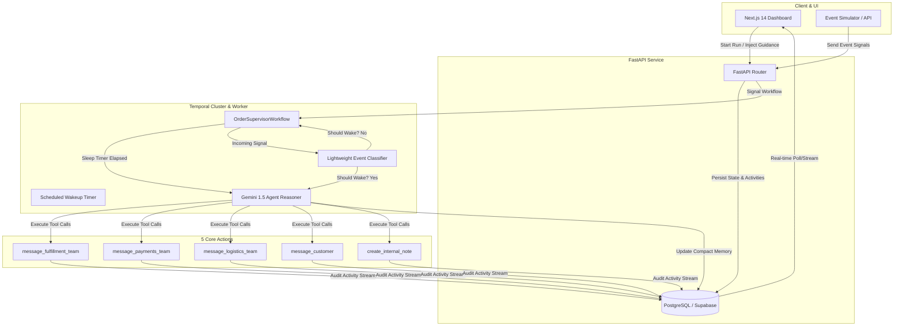

# FlowPilot — Autonomous AI Order Supervisor 🚀

> **A long-running, event-driven AI supervisor that durably monitors e-commerce order lifecycles from purchase to delivery.**  
> Built with **Temporal Python SDK**, **Google Gemini API**, **PostgreSQL (Supabase)**, **FastAPI**, and **Next.js 14**.

---

## 🏗️ Architecture & Flow Overview

FlowPilot assigns a persistent AI supervisor to each active order. Instead of constantly polling in a high-cost infinite loop, FlowPilot utilizes **Temporal's deterministic sleep/wake state machines** combined with a **lightweight classifier** to wake the Gemini LLM agent only when meaningful business decisions are required.



---

## ⚡ The 3 Supervisor Trigger Mechanisms

1. **Workflow Start**: Initial order state evaluation, validation of address/payment/priority, and baseline memory snapshot creation.
2. **Incoming Event Signals**: Evaluated first by the lightweight classifier (waking immediately on `payment_failed`, `shipment_delayed`, `customer_message_received`, `refund_requested`, or `delivered`, while filtering out routine progress updates).
3. **Scheduled Wake-up Timer**: Durable non-blocking timer (`workflow.wait_condition(...)` with timeout) for periodic order health checks.

---

## 🛠️ The 5 Required Business Actions

FlowPilot is equipped with 5 dedicated tool actions via Gemini structured tool calling:

1. `message_fulfillment_team` — Send instructions/holds to the warehouse packing line.
2. `message_payments_team` — Flag failed payments, chargebacks, fraud reviews, and refund approvals.
3. `message_logistics_team` — Carrier dispatch instructions (tracking delays, expedite requests, rerouting).
4. `message_customer` — Empathetic, transparent email/sms status updates and reassurance.
5. `create_internal_note` — Audit trail for supervisor decisions, risks, and observations.

---

## 📦 Project Structure

```
FlowPilot/
├── backend/
│   ├── app/
│   │   ├── agent/                 # Gemini LLM Reasoner, Classifier & Tools
│   │   │   ├── classifier.py      # Event wake/sleep policy evaluator
│   │   │   ├── memory.py          # Rolling context compaction & retrospective
│   │   │   ├── reasoner.py        # Gemini 1.5 reasoning runtime
│   │   │   └── tools.py           # 5 Business tool schemas
│   │   ├── api/                   # FastAPI REST routes
│   │   │   ├── router.py          # Unified API router
│   │   │   ├── runs.py            # Order runs & lifecycle endpoints
│   │   │   ├── simulator.py       # Event simulator endpoints
│   │   │   └── supervisors.py     # Supervisor persona templates CRUD
│   │   ├── core/
│   │   │   └── config.py          # Pydantic Settings & DB URL normalization
│   │   ├── db/
│   │   │   ├── init_db.py         # Table creation & template seeders
│   │   │   └── session.py         # Async SQLAlchemy & asyncpg engine
│   │   ├── models/                # PostgreSQL Models (Supervisor, OrderRun, RunActivity)
│   │   ├── schemas/               # Pydantic Request/Response Validation schemas
│   │   ├── services/
│   │   │   ├── run_service.py     # Orchestration service
│   │   │   └── temporal_client.py # Resilient Temporal connection client
│   │   └── temporal/
│   │       ├── activities.py      # Durable side-effect activities
│   │       ├── worker.py          # Temporal Worker runner
│   │       └── workflows.py       # OrderSupervisorWorkflow state machine
│   ├── scripts/
│   │   └── simulate_order.py      # End-to-end Python demo simulation
│   ├── tests/
│   │   └── test_api.py            # Automated pytest test suite
│   ├── requirements.txt           # Python dependencies
│   └── main.py                    # FastAPI application entrypoint
├── frontend/
│   ├── src/
│   │   ├── app/                   # Next.js 14 App Router (layout, page, styles)
│   │   ├── components/            # UI Components (Inspector, Timeline, Simulator)
│   │   └── lib/                   # Typed API client & interfaces
│   ├── package.json
│   ├── tailwind.config.ts
│   └── tsconfig.json
├── plan.md                        # Architectural roadmap & learning guide
├── pytest.ini                     # Pytest configuration
└── README.md                      # Complete system documentation
```

---

## 🚀 Quickstart & Setup Guide

### 1. Prerequisites
- Python 3.11+ or 3.12+
- Node.js 18+ or 20+
- (Optional) Temporal CLI or Server (`temporal server start-dev`)
- (Optional) PostgreSQL / Supabase connection URL & Gemini API Key

---

### 2. Backend Setup

```bash
# 1. Create and activate virtual environment
cd backend
python -m venv venv

# Windows PowerShell:
.\venv\Scripts\Activate.ps1
# Linux / macOS:
source venv/bin/activate

# 2. Install dependencies
pip install -r requirements.txt

# 3. Configure environment variables
cp .env.example .env
# Edit backend/.env with your GEMINI_API_KEY and DATABASE_URL (Supabase)
```

#### Run Database Initializer & Seed Templates
```bash
python -m backend.app.db.init_db
```

#### Run Automated Test Suite
```bash
pytest
```

#### Start FastAPI Server
```bash
uvicorn backend.main:app --host 0.0.0.0 --port 8000 --reload
```
API Documentation will be live at: `http://localhost:8000/docs`

#### Start Temporal Worker (when Temporal is running)
```bash
python -m backend.app.temporal.worker
```

---

### 3. Frontend Setup (Next.js 14 Dashboard)

```bash
cd frontend
npm install
npm run dev
```
Open **`http://localhost:3000`** in your browser to access the FlowPilot dashboard.

---

### 4. Running the Standalone Simulation Script

You can verify the complete supervisor workflow (start, payment failure, tool executions, compact memory, and final retrospective synthesis) without launching the full cluster:

```bash
python -m backend.scripts.simulate_order
```

---

## 📡 API Endpoints Reference

| Method | Endpoint | Description |
|---|---|---|
| `GET` | `/health` | System health check & DB status |
| `GET` | `/api/supervisors` | List all supervisor templates |
| `POST` | `/api/supervisors` | Create a new supervisor template |
| `POST` | `/api/runs` | Start a new AI Order Supervisor run |
| `GET` | `/api/runs` | List active & completed order runs |
| `GET` | `/api/runs/{id}` | Get run details, compact memory, and timeline |
| `POST` | `/api/runs/{id}/events` | Dispatch event signals (`payment_failed`, `shipment_delayed`, etc.) |
| `POST` | `/api/runs/{id}/instructions` | Inject live human operator guidance |
| `POST` | `/api/runs/{id}/pause` | Pause active supervisor workflow |
| `POST` | `/api/runs/{id}/resume` | Resume paused workflow |
| `POST` | `/api/runs/{id}/terminate` | Terminate workflow and generate final retrospective |
| `GET` | `/api/simulator/events` | Fetch pre-configured event templates |
| `POST` | `/api/simulator/batch-scenario` | Dispatch batch simulation scenarios |

---

## 📄 License
MIT License. Built for the SagePilot AI Order Supervisor Assessment.